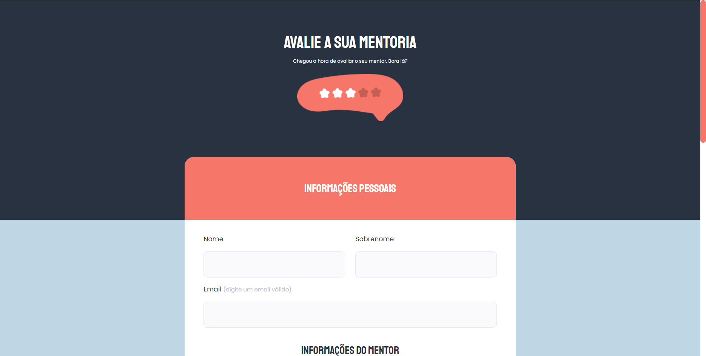

# Formulário

Projeto feito para recriar um site com um formulário a partir de um layout do Figma, pra treinar conceitos de html e css vistos em uma aula da Rocketseat.  
Site responsivo.

## Tecnologias
- HTML  
- CSS  
- Git

## Layout
Você pode visualizar o layout do projeto através [desse link](<https://www.figma.com/file/fnZyJHs7eqNFAA7tUrKcsD/Stage-03---Formul%C3%A1rio-avan%C3%A7ado/duplicate?type=design&node-id=0-1>).  
É necessário ter uma conta no [Figma](https://www.figma.com).
 

  

